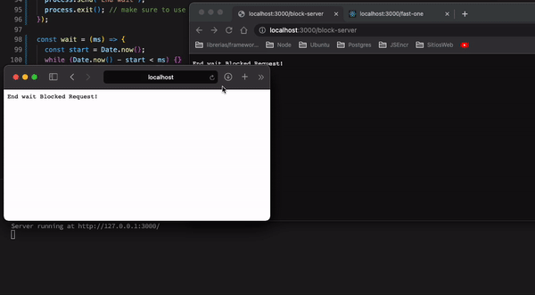
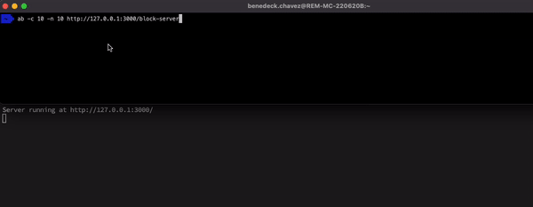
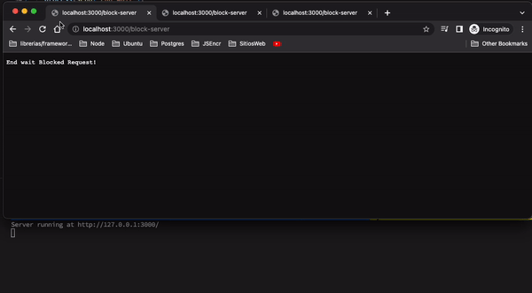
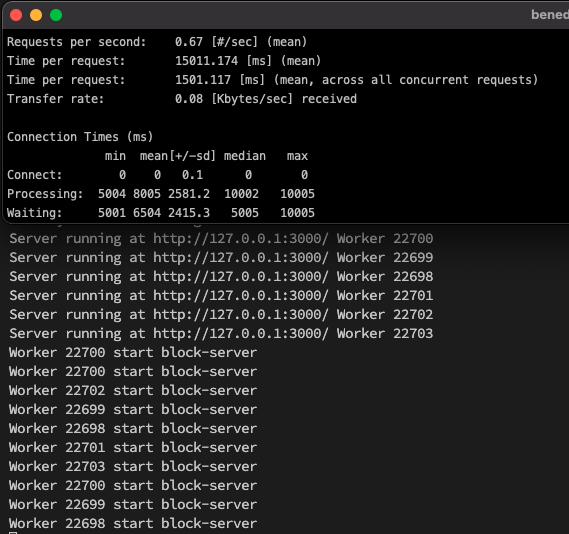
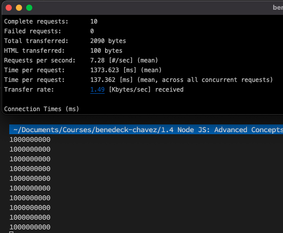

# Child process, Cluster, Worker

**Example of blocked server**

```js script
const http = require("node:http");

const hostname = "127.0.0.1";
const port = 3000;

const wait = (ms) => {
  const start = Date.now();
  while (Date.now() - start < ms) {}
};

const server = http.createServer();

server.listen(port, hostname, () => {
  console.log(`Server running at http://${hostname}:${port}/`);
});

// add additional listener
server.on("request", function (req, res) {
  if (req.url === "/block-server") {
    res.statusCode = 200;
    wait(5000);
    res.setHeader("Content-Type", "text/plain");
    res.end("Blocked Request!\n");
  }

  if (req.url === "/fast-one") {
    res.statusCode = 200;
    res.setHeader("Content-Type", "text/plain");
    res.end("I am unblocked now!\n");
  }
});
```

If we are running this heavy CPU bound operation in the context of a web application,the single thread of node will be blocked and hence the webserver won't be able to respond to any request because it is busy whit a big calculation or something.


Node js provides three solutions for solving this problem
**child processes**
**cluster**
**worker threads**

# Child fork process

The node:child_process module provides the ability to spawn subprocesses which has their own memory.

child_process.fork() is specifically used to spawn new nodejs processes. Like spawn, the returned childProcess object will have built-in IPC communication channel that allows messages to be passed back and forth between the parent and child.

#### index.js

```js script
const http = require("node:http");
const { fork } = require("child_process");

const hostname = "127.0.0.1";
const port = 3000;

function getTime() {
  const today = new Date();
  const time =
    today.getHours() + ":" + today.getMinutes() + ":" + today.getSeconds();

  return time;
}

const server = http.createServer();

server.listen(port, hostname, () => {
  console.log(`Server running at http://${hostname}:${port}/`);
});

// add additional listener
server.on("request", function (req, res) {
  if (req.url === "/block-server") {
    const childProcess = fork(__dirname + "/forkedChild.js"); //the first argument to fork() is the name of the js file to be run by the child process

    childProcess.send("start wait " + getTime()); //send method is used to send message to child process through IPC

    childProcess.on("message", (message) => {
      //on("message") method is used to listen for messages send by the child process
      res.setHeader("Content-Type", "text/plain");
      res.end(message + " Blocked Request!\n");
    });
  }

  if (req.url === "/fast-one") {
    res.statusCode = 200;
    res.setHeader("Content-Type", "text/plain");
    res.end("I am unblocked now!\n");
  }
});
```

#### forkedChild.js

```js script
process.on("message", (message) => {
  //child process is listening for messages by the parent process
  console.log(message);
  wait(5000);
  process.send("End wait");
  process.exit(); // make sure to use exit() to prevent orphaned processes
});

const wait = (ms) => {
  const start = Date.now();
  while (Date.now() - start < ms) {}
};
```

Using fork(), we can solve the problem by forking a separate nodejs process and executing the function in that process and return the answer to the parent process whenever it is done. In that way, the parent process won't be blocked and can continue responding to requests.

#### Simulate 2 clients



#### Simulate 10 clients



Testing on the same instance of google chrome, seem that the server is still blocked for the endpoint "/block-server"



# Cluster

Clusters of Node.js processes can be used to run multiple instances of Node.js that can distribute workloads among their application threads. When process isolation is not needed, use the worker_threads module instead, which allows running multiple application threads within a single Node.js instance.

The cluster module allows easy creation of child processes that all share server ports. Ideally, the number of processes forked should be equal to the number of cpu cores your machine has.

```js script
const cluster = require("node:cluster");
const http = require("node:http");
const process = require("node:process");

const hostname = "127.0.0.1";
const port = 3000;
const wait = (ms) => {
  const start = Date.now();
  while (Date.now() - start < ms) {}
};
if (cluster.isPrimary) {
  console.log(`Primary ${process.pid} is running`);

  // Fork workers.
  for (let i = 0; i < 6; i++) {
    cluster.fork();
  }

  cluster.on("exit", (worker, code, signal) => {
    console.log(`worker ${worker.process.pid} died`);
  });
} else {
  // Workers can share any TCP connection
  // In this case it is an HTTP server
  server = http.createServer();

  server.listen(port, hostname, () => {
    console.log(
      `Server running at http://${hostname}:${port}/ Worker ${process.pid}`
    );
  });

  // add additional listener
  server.on("request", function (req, res) {
    if (req.url === "/block-server") {
      console.log(`Worker ${process.pid} start block-server`);
      wait(5000);
      res.statusCode = 200;
      res.setHeader("Content-Type", "text/plain");
      res.end("Blocked Request!\n");
    }

    if (req.url === "/fast-one") {
      res.statusCode = 200;
      res.setHeader("Content-Type", "text/plain");
      res.end("I am unblocked now!\n");
    }
  });
}
```

When we start to use clustering inside of a node application, we're going to be starting up multiple node processes.
There's always going to be one parent process or one kind of like overarching process called the cluster manager.
The cluster manager is responsible for monitoring the health of individual instances of our application that we're going to launch at the same time on our computer.
So all the stuff that we see right here, these are all instances of our application that are runnings on our singular computer.



# Workers

Essentially the difference between worker threads and child processes is same as the difference between a thread and a process.Ideally, the number of threads created should be equal to number of cpu cores.

Workers (threads) are useful for performing CPU-intensive JavaScript operations. They do not help much with I/O-intensive work. The Node.js built-in asynchronous I/O operations are more efficient than Workers can be.

#### index.js

```js script
const express = require("express");
const app = express();
const { Worker } = require("worker_threads");

app.get("/", (req, res) => {
  const worker = new Worker("./worker.js");

  worker.on("message", function (message) {
    console.log(message);
    res.send("" + message);
  });

  worker.postMessage("start!");
});

app.get("/fast", (req, res) => {
  res.send("This was fast!");
});

app.listen(3000);
```

#### worker.js

```js script
const { parentPort } = require("worker_threads");

parentPort.on("message", () => {
  let counter = 0;
  while (counter < 1e9) {
    counter++;
  }

  parentPort.postMessage("" + counter);
});
```


