# Continuous Integration (CI)

Is a development practice where developers integrate code into a shared repository frequently, preferably several times a day. Each integration can then be verified by an automated build and automated tests. While automated testing is not strictly part of CI it is typically implied. One of the key benefits of integrating regularly is that you can detect errors quickly and locate them more easily. As each change introduced is typically small, pinpointing the specific change that introduced a defect can be done quickly. In recent years CI has become a best practice for software development and is guided by a set of key principles. Among them are revision control, build automation and automated testing.

# CI with Travis

As a continuous integration platform, Travis CI supports your development process by automatically building and testing code changes, providing immediate feedback on the success of the change. Travis CI can also automate other parts of your development process by managing deployments and notifications.

# Using Travis

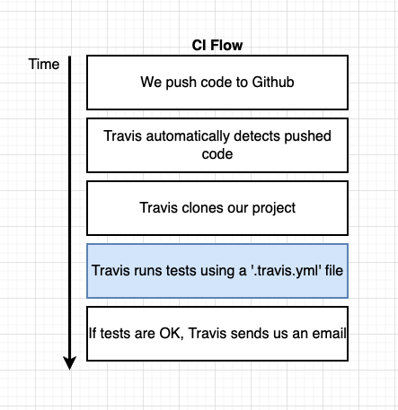

1.- Make an account, and select a plan

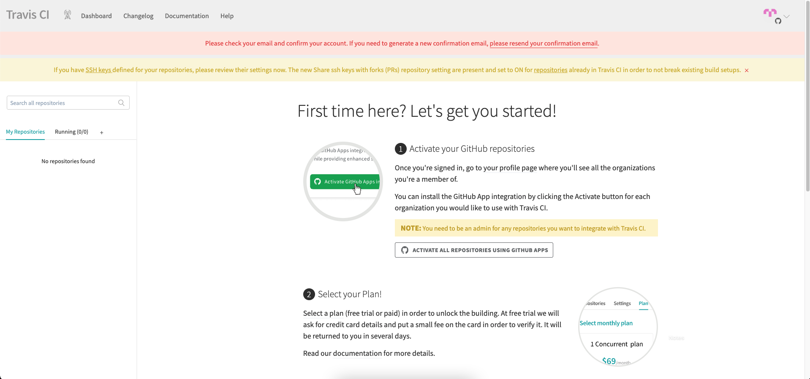

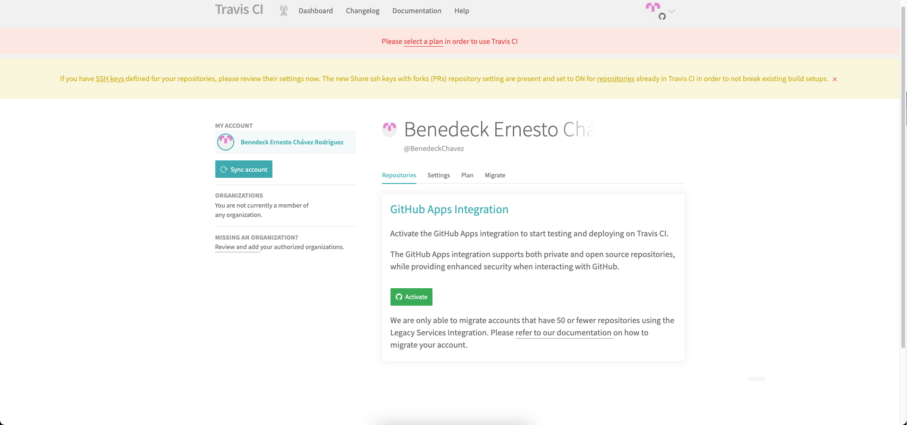


2.- Give Travis access to the repositories

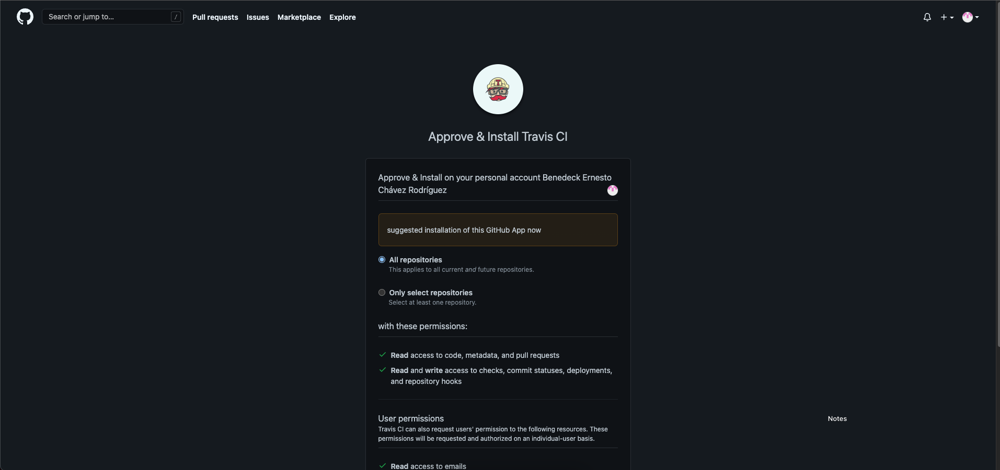

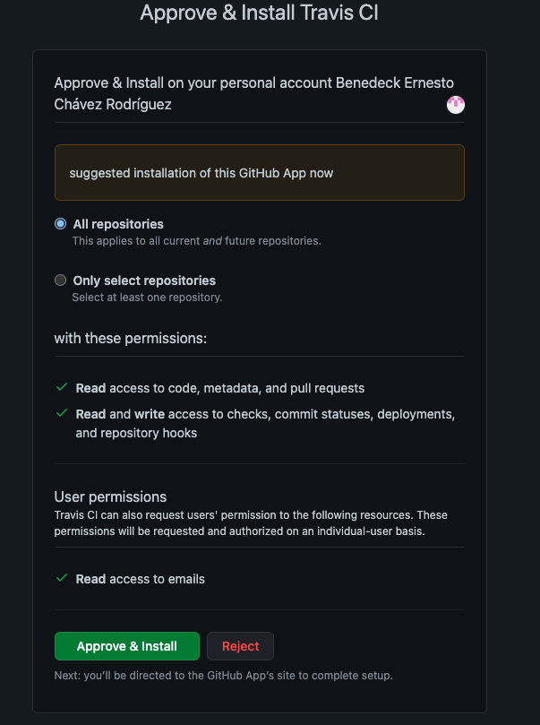

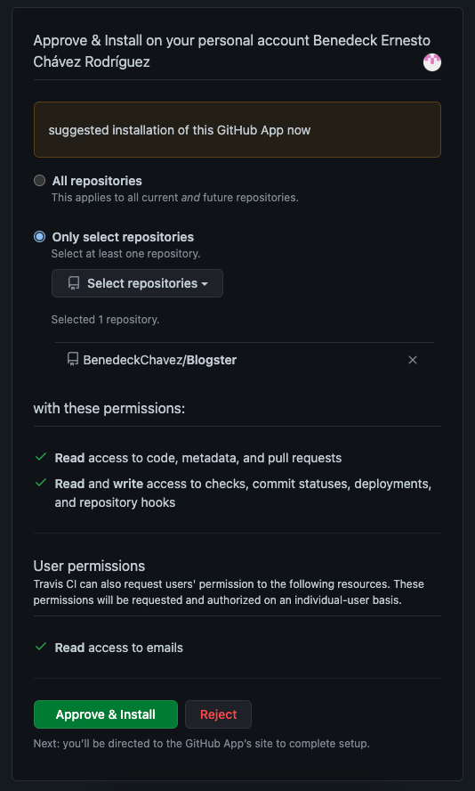

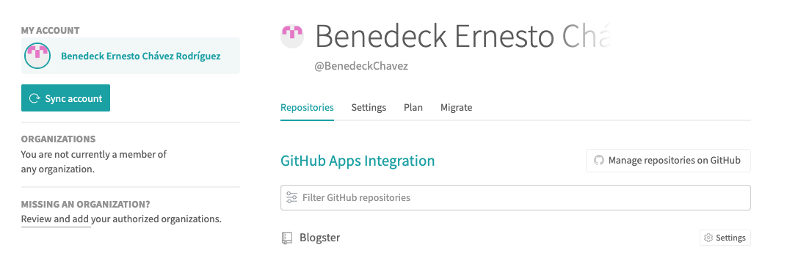

3.- Make a .travis.yml document in your project, this yml will tell Travis what to do

https://docs.travis-ci.com/user/for-beginners/

```yml
language: node_js
node_js:
  - "14" #version of node
dist: trusty #Distribution Ubuntu Trusty 14.04
services:
  - mongodb
  - redis-server
env:
  - NODE_ENV=ci PORT=3000
cache: #it should save that that folder or cache it for future builds as well.
  directories:
    - node_modules
    - client/node_modules
install:
  - npm install
  - npm run build
script:
  #nohup - if the shell is closed, dont kill anything this command creates
  #npm run start - run the server
  #& - run this command in a sub shell (in the background)
  - nohup npm run start &
  #sleep x - wait for x seconds
  - sleep 3
  - npm run test
```

4. Make a push of the project then you can see travis do its work

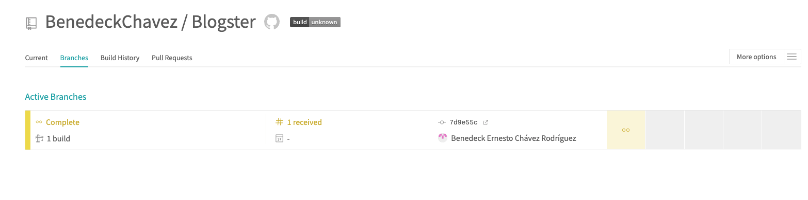

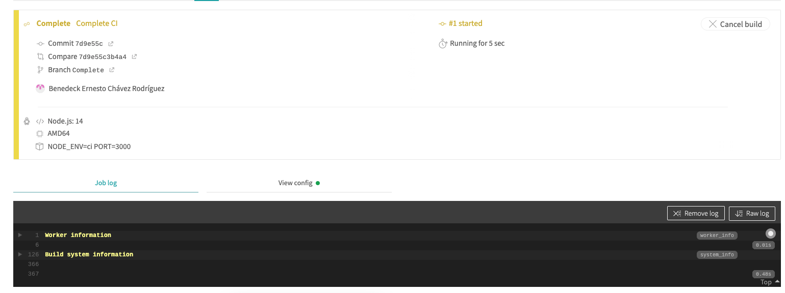

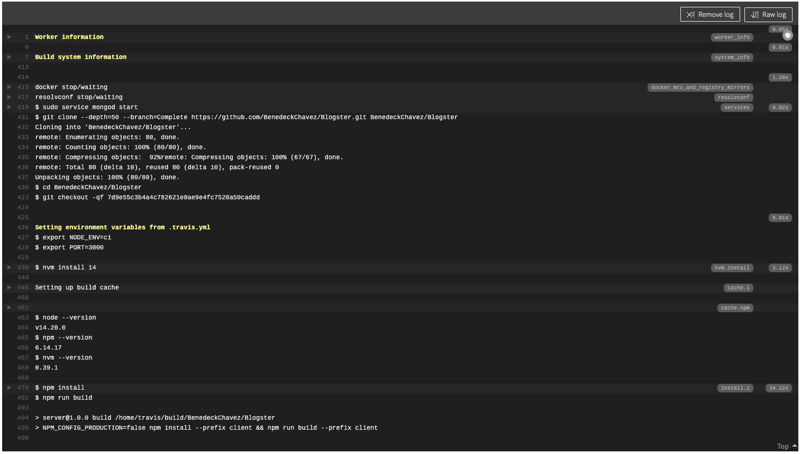

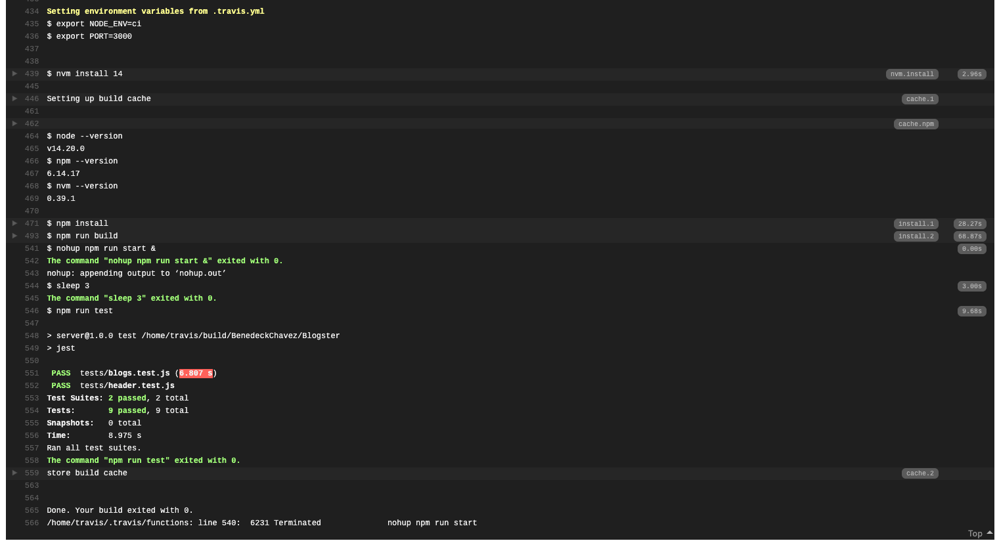

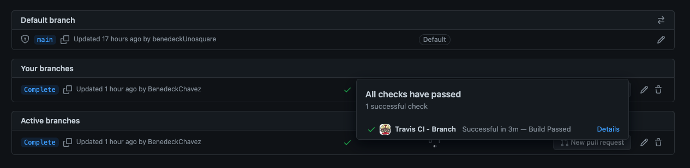
