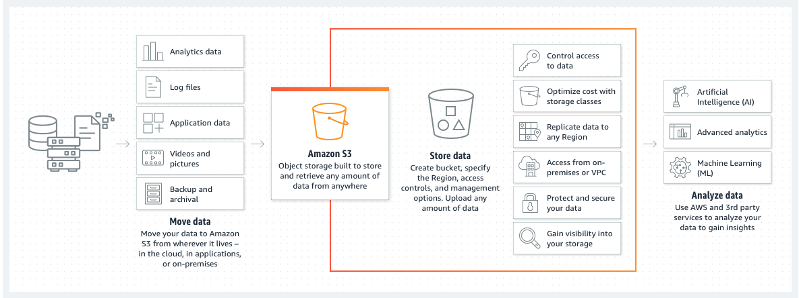

There are many different data storage providers out there today.
Some common examples are Amazon S3 or Google cloud storage.
These are all systems made for storing tremendous amounts of data and it can be any type of file you can possibly imagine.
So not just images as we're going to use, but also video files, text files, sound files, anything you can possibly imagine.
We can easily store inside of any of these storage mechanisms.

- We only pay for the data storage that we are actually using inside of our app.

- It's cheap compared to database storage

# AWS S3

Amazon Simple Storage Service (Amazon S3) is an object storage service offering industry-leading scalability, data availability, security, and performance. Customers of all sizes and industries can store and protect any amount of data for virtually any use case, such as data lakes, cloud-native applications, and mobile apps.

Upload process From BlogApp

client --> Express API (ask for a presigned URL) --> Amazon S3

Amazon (gives presigned URL, works only for a file matching the original name ) --> Express API

Express API (sends URL) --> client (uploads img) --> Amazon S3

client (tells server upload was successful) --> Express API (Save URL of the new image with the blog)

# Presigned URL

- Can only be used for single file upload
- Encodes the file name and type of file can expire
- Is generated by a secure request between our server and AWS
- Only works for the S3 bucket it is created for

# IAM

AWS Identity and Access Management (IAM) provides fine-grained access control across all of AWS. With IAM, you can specify who can access which services and resources, and under which conditions. With IAM policies, you manage permissions to your workforce and systems to ensure least-privilege permissions.

IAM is an AWS service that is offered at no additional charge. To get started using IAM or if you have already registered with AWS, go to the IAM console.

- Inside of AWS IAM there are two different structures or two different types of records among several others.

One is called a policy and the other is called a user.

- A policy is a record that describes what someone or something can do inside of us.

- Policies alone, however, don't actually get assigned to any particular person or record automatically.

- So a user represents an actual person or application inside of our Amazon account.
