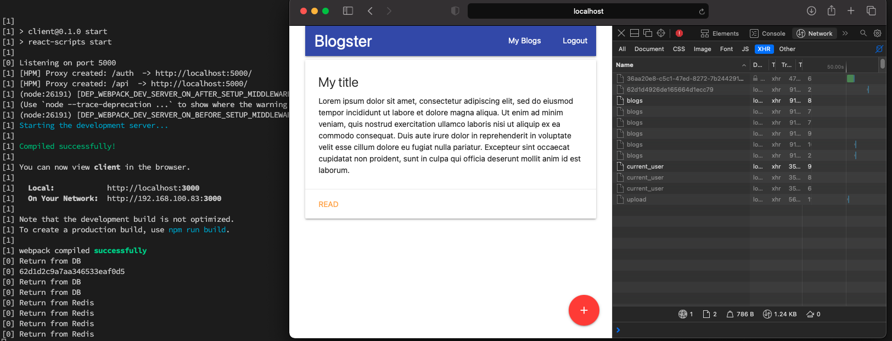

# AdvancedNodeStarter

Complete project for a course on Advanced Node @ Udemy

To run the code is needed to install dependencies with npm install in root folder and client folder

# Working app preview

#### Open App

#### Login with OAuth

When we talk about OAuth (Open Authorization), we mean an identity and access management (IAM) solution. Its purpose is to grant authorizations to users.

#### Get Blogs (Empty)

#### Create new Blog

#### Preview and Add image

#### Get Blogs (With the new one)

#### Preview Blog with image from S3

#### Get data from Redis

