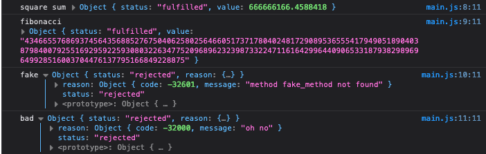

```
npx serve
```

In this case you can see that both the square_sum and fibonacci calls ended successfully, while the fake_method command resulted in failure. More importantly, under the hood, the calls to the methods are resolving in different orders, but thanks to the incrementing id values the responses are always properly correlated to their requests.


