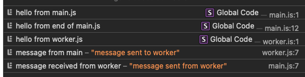

```
npx serve
```

First, the main.js file is loaded, and its output is printed. The worker is instantiated and configured, its postMessage() method is called, and then the last message gets printed as well. Next, the worker.js file is run, and its message handler is called, printing a message. It then calls postMessage() to send a message back to main.js. Finally, the onmessage handler for the dedicated worker is called in main.js, and the final message is printed.


