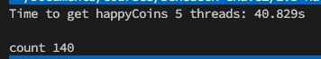

# Happycoin

Recall that Happycoin is our imaginary cryptocurrency, with a completely ridiculous proof-of-work algorithm that goes as follows:

1. Generate a random unsigned 64-bit integer.
2. Determine whether or not the integer is happy.
3. If it’s not happy, it’s not a Happycoin.
4. If it’s not divisible by 10,000, it’s not a Happycoin. 5. Otherwise, it’s a Happycoin.

# happyCoin 6 childProcess

# happyCoin single thread

# happyCoin 2 worker_threads

# happyCoin 3 worker_threads

# happyCoin 4 worker_threads (bottle-neck)

# happyCoin 5 worker_threads

# happyCoin 4 threads in a piscina

You should see output the same as earlier examples. This code run in roughly the same time as happycoin-threads.js, since it uses the same principle, but with the abstraction layer that piscina provides us.
