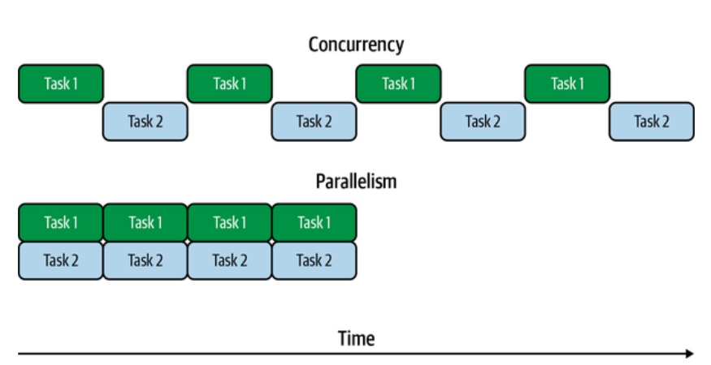
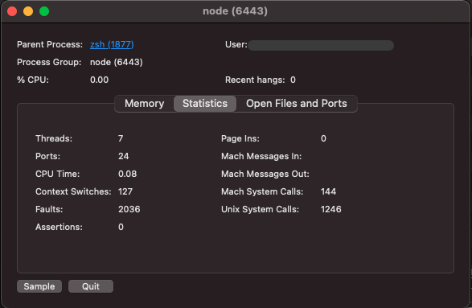

# Basics

1. [What Are Threads?](#whatAreThreads)
2. [Concurrency Versus Parallelism](#concurrencyParallelism)
3. [Single-Threaded JavaScript](#singleThreaded)
4. [Hidden Threads](#hiddenThreads)

**Cooperative multitasking** Programs could decide when it would be an appropriate time to let another program run by yielding execution to the operating system.

**Preemptive multitasking** In this model, the operating system would determine which program would run on the CPU at which time, using its own notion of scheduling, rather than relying on the programs themselves to be the sole deciders of when to switch execution.

# <a id="whatAreThreads"></a> What Are Threads?

When you execute a program, such as Node.js or a code editor, you’re initiating a process. This means that code is loaded into a memory space unique to that process.

A program may spawn additional processes, which have their own memory space. These processes do not share memory (unless it’s mapped in via additional system calls) and have their own instruction pointers, meaning each one can be executing a different instruction at the same time.

A process may also spawn threads, rather than full-blown processes. A thread is just like a process, except that it shares memory space with the process that it belongs to. A process can have many threads, and each one has its own instruction pointer.

Because they share a memory space, it’s easy to share program code and other values between threads. This makes them more valuable than processes for adding concurrency to programs, but at the cost of some complexity in programming.

# <a id="concurrencyParallelism"></a> Concurrency Versus Parallelism



- Concurrency
  Tasks are run in overlapping time.

- Parallelism
  Tasks are run at exactly the same time.

Threads do not automatically provide parallelism. The system hardware must allow for this by having multiple CPU cores, and the operating system scheduler must decide to run the threads on separate CPU cores.

On single-core systems, or systems with more threads running than CPU cores, multiple threads may be run on a single CPU concurrently by switching between them at appropriate times.

# <a id="singleThreaded"></a> Single-Threaded JavaScript

The language itself does not have any built-in functionality to create threads. This shouldn’t be that much of a surprise because it also doesn’t have any built-in functionality to interact with the network, devices, or filesystem, or to make any system calls. Indeed, even such basics as setTimeout() aren’t actually JavaScript features. Instead environments the virtual machine (VM) is embedded in, such as Node.js or browsers, provide these via environment-specific APIs.

Even in promises or the async/await syntax, callbacks are the underlying primitive. It’s important to recognize that callbacks are not running in parallel, or alongside any other code. When code in a callback is running, that’s the only code that’s currently running. Put another way, only one call stack is active at any given time.

```js
import fs from "fs/promises";
async function getNum(filename) {
  return parseInt(await fs.readFile(filename, "utf8"), 10);
}
try {
  const numberPromises = [1, 2, 3].map((i) => getNum(`${i}.txt`));
  const numbers = await Promise.all(numberPromises);
  console.log(numbers[0] + numbers[1] + numbers[2]);
} catch (err) {
  console.error("Something went wrong:");
  console.error(err);
}
```

[Example file...](../Examples/Promise-all/)

Since we’re using Promise.all(), we’re waiting for all three files to be read and parsed. However, just because the promises are being created together and waited upon together doesn’t mean that the code resolving them runs at the same time, it just means their time frames are overlapping. There’s still only one instruction pointer, and only one instruction is being executed at a time.

In the absence of threads, there’s only one JavaScript environment to work with. This means one instance of the VM, one instruction pointer, and one instance of the garbage collector. In both the browser and Node.js, we have **realms** at our disposal.

**Realms** can be thought of as instances of the JavaScript environment as provided to JavaScript code. This means that each realm gets its own global object. The global object is referred to as **global** in Node.js and **window** in browsers, but in modern versions of both, you can refer to the global object as **globalThis**.

In browsers, each frame in a web page has a realm for all of the JavaScript within it.

```js
const iframe = document.createElement("iframe");
document.body.appendChild(iframe);

//The global object inside the iframe is accessible with the contentWindow property.
const FrameObject = iframe.contentWindow.Object;

//This returns false, so the Object inside the frame is not the same as in the main frame.
console.log(Object === FrameObject);

//instanceof evaluates to false, as expected since they’re not the same Object.
console.log(new Object() instanceof FrameObject);

//Despite all this, the constructors have the same name property.
console.log(FrameObject.name);
```

In Node.js, realms can be constructed with the **vm.createContext()** function. In Node.js parlance, realms are called Contexts. All the same rules and properties applying to browser frames also apply to Contexts, but in Contexts, you don’t have access to any global properties or anything else that might be in scope in your Node.js files. If you want to use these features, they need to be manually passed in to the Context.

```js
const vm = require("vm");

//We can get objects from a new context using runInNewContext.
const ContextObject = vm.runInNewContext("Object");

//This returns false, so as with browser iframes, Object inside the context is not the same as in the main context.
console.log(Object === ContextObject);

//Similarly, instanceof evaluates to false.
console.log(new Object() instanceof ContextObject);

//Once again, the constructors have the same name property.
console.log(ContextObject.name);
```

In any of these realm cases, it’s important to note that we still only have one instruction pointer, and code from only one realm is running at a time, because we’re still only talking about single-threaded execution.

# <a id="hiddenThreads"></a> Hidden Threads

Modern JavaScript engines like V8 use separate threads to handle garbage collection and other features that don’t need to happen in line with JavaScript execution. In addition, the platform runtimes themselves may use additional threads to provide other features.

In Node.js, libuv is used as an OS-independent asynchronous I/O interface, and since not all system-provided I/O interfaces are asynchronous, it uses a pool of worker threads to avoid blocking program code when using otherwise-blocking APIs, such as filesystem APIs.

You can see the various V8 and libuv threads add up to seven threads, including the one that the JavaScript code runs in.


Browsers similarly perform many tasks, such as Document Object Model (DOM) rendering, in threads other than the one used for JavaScript execution.

#

Any programming language supporting threads is going to provide some mechanisms for creating and destroying threads, passing messages in between, and interacting with data that’s shared between the threads.

[Examples files...](../Examples/happyCoin)
