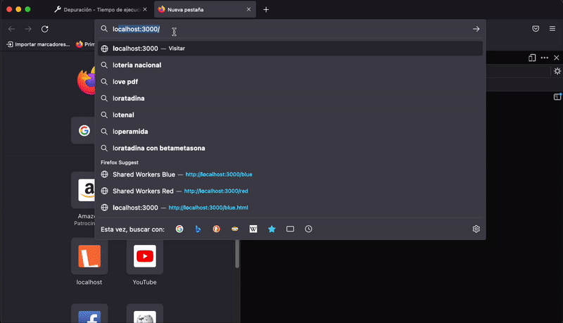

# Browsers

1. [Dedicated Workers](#dedicatedWorkers)
2. [Shared Workers](#sharedWorkers)
3. [Service Workers](#serviceWorkers)
4. [Message Passing Abstractions](#abstractions)
5. [Putting It All Together](#together)

JavaScript has many different implementations. This includes the JavaScript engine that ships with different web browsers, such as V8 in Chrome, SpiderMonkey in Firefox, and JavaScriptCore in Safari. The V8 engine is also used by Node.js on the server.

- not every engine implements JavaScript the same way.

This chapter focuses entirely on the multithreaded APIs that are provided by modern web browsers, the most approachable of which is the web worker.

Using these worker threads is beneficial for many reasons, but one that is particularly applicable to browsers is that, by offloading CPU-intensive work to a separate thread, the main thread is then able to dedicate more resources to rendering the UI.

https://serviceworke.rs

# <a id="dedicatedWorkers"></a> Dedicated Workers

- Being associated with one page

- Web workers allow you to spawn a new environment for executing JavaScript in.

- It’s possible for a JavaScript environment to spawn more than one web worker

- Web worker is free to spawn even more web workers.

[Dedicated Worker](../Examples/DedicateWorker/)


**Advanced Dedicated Worker Usage**

- When it comes to dedicated workers, you can’t inject a script tag into the DOM because there’s no DOM associated with the worker.

- importScripts() is a global function only available within web workers. This function accepts one or more arguments that represent the paths to scripts to be loaded.

- worker.postMessage(msg)
  This sends a message to the worker that is handled by the event loop before invoking the self.onmessage function, passing in msg.

- worker.onmessage
  If assigned, it is in turn invoked when the self.postMessage function inside the worker is called.

- worker.onerror
  If assigned, it is invoked when an error is thrown inside the worker. A single ErrorEvent argument is provided, having .colno, .lineno, .filename, and .message properties. This error will bubble up unless you call err.preventDefault().

- worker.onmessageerror
  If assigned, this is invoked when the worker receives a message that it cannot deserialize.

- worker.terminate()
  If called, the worker terminates immediately. Future calls to worker.postMessage() will silently fail.

When instantiating a dedicated worker, there is an optional second argument for specifying the options for the worker.

```js
const worker = new Worker(filename, options);
```

- type
  Either classic (default), for a classic JavaScript file, or module, to specify an ECMAScript Module (ESM).

- credentials
  This value determines if HTTP credentials are sent with the request to get the worker file. The value can be omit to exclude the credentials, same-origin to send credentials (but only if the origin matches), or include to always send the credentials.

- name
  This names a dedicated worker and is mostly used for debugging. The value is provided in the worker as a global named name.

# <a id="sharedWorkers"></a> Shared Workers

A shared worker is another type of web worker, but what makes it special is that a shared worker can be accessed by different browser environments, such as different windows (tabs), across iframes, and even from different web workers. They also have a different self within the worker, being an instance of SharedWorkerGlobalScope. A shared worker can only be accessed by JavaScript running on the same origin.

Shared workers can be used to hold a semipersistent state that is maintained when other windows connect to it.

[Shared Worker](../Examples/SharedWorker/)


#### DEBUGGING SHARED WORKERS

- In Firefox, visit about:debugging in the address bar. Next, click This Firefox in the left column. Then, scroll down until you see the Shared Workers section with a list of shared worker scripts. In our case we see an Inspect button next to an entry for the shared-worker.js file.

- With Chrome, visit chrome://inspect/#workers, find the shared-worker.js entry, and then click the “inspect” link next to it. With both browsers you’ll be taken to a dedicated console attached to the worker.

- Shared workers are currently disabled in Safari, and this seems to have been true since at least 2013.

**Advanced Shared Worker Usage**

- Being associated with one or more pages

- Shared workers also have access to the importScripts() function for loading external JavaScript files.

- Firefox is more convenient to debug shared workers with due to the output of console.log() from the shared worker being available.

The full constructor for the SharedWorker class looks like this:

```js
const worker = new SharedWorker(filename, nameOrOptions);
```

For example, could the shared worker be declared in red.js with a name of “red worker” and in blue.js with a name of “blue worker”? In this case, two separate workers will be created, each with a different global environment, a different ID value, and the appropriate self.name.

Other than the ability to replace the options argument with a string name, the options argument for a SharedWorker is exactly the same as it is for a Worker.

# <a id="serviceWorkers"></a> Service Workers

- Being associated with zero or more pages.

- A service worker functions as a sort of proxy that sits between one or more web pages running in the browser and the server.

- They’re even “keyed” in the same manner as shared workers.

- But a service worker can exist and run in the background even when a page isn’t necessarily still open.

- Service workers are primarily intended for performing cache management of a website or a single page application.

- Browsers will only allow service workers to run on a web page that has been served using the HTTPS protocol.

[Dedicated Worker](../Examples/ServiceWorker/)



#### DEBUGGING SERVICE WORKERS

- In Firefox, open the address bar and visit about:debugging#/runtime/this-firefox. Scroll down to the service workers and any workers you create today should be visible at the bottom.

- For Chrome, there are two different screens available for getting access to the browser’s service workers. The more robust page is located at chrome://serviceworker-internals/. It contains a listing of service workers, their status, and basic log output. The other one is at chrome://inspect/#service-workers, and it contains a lot less information.

**Advanced Service Worker Concepts**

- localStorage API, which technically blocks when reading and writing, isn’t available.

- The asynchronous indexedDB API is available.

- Top-level await is disabled within service workers as well.

When it comes to keeping track of state, you’ll mostly be using self.caches and indexedDB. Keeping data in a global variable isn’t going to be reliable.

Every service worker goes through a state change from the time of its inception until the time it can be used. This state is available within the service worker by reading the self.serviceWorker.state property. Here’s a list of the stages it goes through:

- parsed
  This is the very first state of the service worker. At this point the JavaScript content of the file has been parsed. This is more of an internal state that you’ll probably never encounter in your application.
- installing
  The installation has begun but is not yet complete. This happens once per worker version. This state is active after oninstall is called and before the event.respondWith() promise has resolved.
- installed
  At this point the installation is complete. The onactivate handler is going to be called next.
- activating
  This state happens when onactivate is called but the event.respondWith() promise hasn’t yet resolved.
- activated
  The activation is complete, and the worker is ready to do its thing. At this point fetch events will get intercepted.
- redundant
  At this point, a newer version of the script has been loaded, and the previous script is no longer necessary. This can also be triggered if the worker script download fails, if it contains a syntax error, or if an error is thrown.

# <a id="abstractions"></a> Message Passing Abstractions

When it comes to building larger applications it’ll be important to pass messages along that can scale and run code in workers that can scale, and simplifying the interface when working with workers will also reduce potential errors.

#### The RPC Pattern

The RPC (Remote Procedure Call) pattern is a way to take a representation of a function and its arguments, serialize them, and pass them to a remote destination to have them get executed. The string square_sum|num:1000000 is actually a form of RPC. Perhaps it could ultimately translate into a function call like squareNum(1000000), which is considered in “The Command Dispatcher Pattern”.

Exist a standard for passing messages around and fulfilling the RPC pattern that inspiration can be drawn from. This standard is called **JSON-RPC**, and it’s fairly trivial to implement. This standard defines JSON representations of request and response objects as “notification” objects, a way to define the method being called and arguments in the request, the result in the
response, and a mechanism for associating requests and responses. It even supports error values and batching of requests.

```json
// worker.postMessage
{"jsonrpc": "2.0", "method": "square_sum", "params": [4], "id": 1}
{"jsonrpc": "2.0", "method": "fibonacci", "params": [33], "id": 2}
 // worker.onmessage
{"jsonrpc": "2.0", "result": "3524578", "id": 2}
{"jsonrpc": "2.0", "result": 4.1462643, "id": 1}
```

JSON-RPC is intended to use JSON as the encoding when serializing messages, particularly when sending messages over the network.

#### The Command Dispatcher Pattern

While the RPC pattern is useful for defining protocols, it doesn’t necessarily provide a mechanism for determining what code path to execute on the receiving end. The command dispatcher pattern solves this, providing a way to take a serialized command, find the appropriate function, and then execute it, optionally passing in arguments.

First, we can assume that there are two variables that contain relevant information about the method or command that the code needs to run. The first variable is called method and is a string. The second variable is called args and is an array of values to be passed into the method.

```js
//The definition of all supported commands.
const commands = {
  square_sum(max) {
    let sum = 0;
    for (let i = 0; i < max; i++) sum += Math.sqrt(i);
    return sum;
  },
  fibonacci(limit) {
    let prev = 1n,
      next = 0n,
      swap;
    while (limit) {
      swap = prev;
      prev = prev + next;
      next = swap;
      limit--;
    }
    return String(next);
  },
};
function dispatch(method, args) {
  //Check to see if command exists.
  if (commands.hasOwnProperty(method)) {
    //Arguments are spread and method is invoked.
    return commands[method](...args);
  }
  throw new TypeError(`Command ${method} not defined!`);
}
```

This is about as basic of a command dispatcher as you can create. Other, more advanced dispatchers might do things like type checking, where the arguments are validated to adhere to a certain primitive type or where objects follow the appropriate shape, throwing errors generically so that the command method code doesn’t need to do it.

# <a id="together"></a> Putting It All Together

Combine the RPC pattern and the command dispatcher pattern and end up with an interface that makes working with web workers much like working with other external libraries you may be more familiar with. This example uses a dedicated worker, but the same thing could be built with a shared worker or service worker.

[Dedicated Worker](../Examples/DedicateWorker-RPC/)


