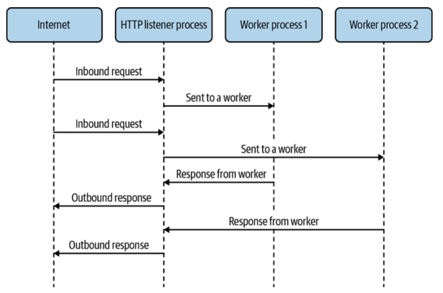

# NodeJS

1. [Before We Had Threads](#before)
2. [The worker_threads Module](#worker_threads)
3. [MessagePort](#messagePort)
4. [Worker Pools with Piscina](#piscina)

Outside browsers, there’s only one JavaScript runtime of note, and that’s Node.js. Although it started as a platform emphasizing single-threaded concurrency in servers with continuation-passing style callbacks, a lot of effort went into making it a general-purpose programming platform.

Parallelism can also be useful in the original Node.js use case, which is servers. Data processing may happen a lot, depending on your application. For example, server side rendering (SSR) involves a lot of string manipulation where the source data is already known. This is one of many examples where we might want to add parallelism to our solutions.

# <a id="before"></a> Before We Had Threads

Prior to threads being available in Node.js, if you wanted to take advantage of CPU cores, you needed to use processes.
If shared memory isn’t important (and in many cases it isn’t!) then processes are perfectly able to solve these kinds of problems for you.



Although we could do something like this using the **child_process** API in Node.js, we’re better off using **cluster**, which was purpose-built for this use case. This module’s purpose is to spread network traffic across several worker processes.

```js
const http = require("http");
const cluster = require("cluster"); //Require the cluster module.

//Change code paths depending on whether we’re in the primary process.
if (cluster.isPrimary) {
  //In the primary process, create four worker processes.
  cluster.fork();
  cluster.fork();
  cluster.fork();
  cluster.fork();
} else {
  //In the worker processes, create a web server and listen
  http
    .createServer((req, res) => {
      res.end("Hello, World!\n");
    })
    .listen(3000);
}
```

When worker processes are set up in a cluster, any call to listen() will actually cause Node.js to listen on the primary process rather than on the worker. Then, once a connection is received in the primary process, it’s handed off to a worker process via IPC.

# <a id="worker_threads"></a> The worker_threads Module

Node.js’s support for threads is in a built-in module called worker_threads. It provides an interface to threads that mimics a lot of what you’d find in web browsers for web workers.

- libuv worker pool is shared across worker threads.

If you’re finding yourself bound by that thread pool’s size (due to, for example, a lot of filesystem I/O), you’ll find that adding more threads via worker_threads won’t lighten the load. Instead, apart from considering various caching solutions and other optimizations, consider increasing your UV_THREADPOOL_SIZE. Likewise, you might find that you have little choice but to increase this when adding JavaScript threads via the worker_threads module, due to their usage of the libuv thread pool.

Spawning a new worker thread in Node.js

```js
const { Worker } = require("worker_threads");

const worker = new Worker("/path/to/worker-file-name.js");
```

Passing data to a worker thread via workerData

```js
const { Worker, isMainThread, workerData } = require("worker_threads");
const assert = require("assert");
if (isMainThread) {
  const worker = new Worker(__filename, { workerData: { num: 42 } });
} else {
  assert.strictEqual(workerData.num, 42);
}
```

Rather than using a separate file for the worker thread, we can use the current file with \_\_filename and switch the behavior based on isMainThread.

# <a id="messagePort"></a> MessagePort

A MessagePort is one end of a two-way data stream. By default, one is provided to every worker thread to provide a communication channel to and from the main thread. It’s available in the worker thread as the parentPort property of the worker_threads module.

- To send a message via the port, the postMesage() method is called on it.

- When a message is received on the port, the message event is fired, with the message data being the first argument to the event handler function.

```js
const { Worker, isMainThread, parentPort } = require("worker_threads");
if (isMainThread) {
  const worker = new Worker(__filename);
  worker.on("message", (msg) => {
    worker.postMessage(msg);
  });
} else {
  parentPort.on("message", (msg) => {
    console.log("We got a message from the main thread:", msg);
  });
  parentPort.postMessage("Hello, World!");
}
```

- You can also create a pair of MessagePort instances connected to each other via the MessageChannel constructor.

- You might want to do this in situations where neither of two threads that need to communicate are the main thread, or even just for organizational purposes.

```js
const {
  Worker,
  isMainThread,
  MessageChannel,
  workerData,
} = require("worker_threads");
if (isMainThread) {
  const { port1, port2 } = new MessageChannel();
  const worker = new Worker(__filename, {
    workerData: {
      port: port2,
    },
    transferList: [port2],
  });
  port1.on("message", (msg) => {
    port1.postMessage(msg);
  });
} else {
  const { port } = workerData;
  port.on("message", (msg) => {
    console.log("We got a message from the main thread:", msg);
  });
  port.postMessage("Hello, World!");
}
```

[Dedicated Worker](../Examples/happyCoin/in-NodeJS/)

# <a id="piscina"></a> Worker Pools with Piscina

For the use case of discrete tasks sent to a pool of worker threads, we have the **piscina** module at our disposal. This module encapsulates the work of setting up a bunch of worker threads and allocating tasks to them. The name of the module comes from the Italian word for “pool.”

- piscina Example

```js
const Piscina = require("piscina");
const assert = require("assert");
const { once } = require("events");

/*Much like cluster and worker_threads,
piscina provides a handy boolean for determining
whether we’re in the main thread or a worker thread. */
if (!Piscina.isWorkerThread) {
  //We’ll use the same technique for using the same file as we did with the Happycoin example.
  const piscina = new Piscina({
    filename: __filename,
    /*The maxQueue option is set to auto, which limits the queue size to the square of the number of threads that piscina is using. */
    maxQueue: "auto",
  });
  /*The for loop is wrapped in an async immediately invoked function expression (IIFE) in order to use an await within it. */
  (async () => {
    for (let i = 0; i < 10_000_000; i++) {
      //When this check is true, the queue is full.
      if (piscina.queueSize === piscina.options.maxQueue) {
        //We then wait for the drain event before submitting any new tasks to the queue.
        await once(piscina, "drain");
      }
      //Since.run() returns a promise, we can just call .then() on it.
      piscina.run(i).then((squareRootOfI) => {
        assert.ok(typeof squareRootOfI === "number");
      });
    }
  })();
}

/*The exported function is used in the worker thread to perform the actual work.
 In this case, it’s just calculating a square root. */
module.exports = (num) => Math.sqrt(num);
```
