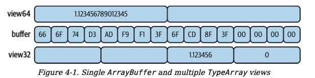

# Shared Memory

1. [Shared Memory in the Browser](#browser)
2. [SharedArrayBuffer and TypedArrays](#TypedArrays)
3. [Atomic Methods for Data Manipulation](#atomic)
4. [Data Serialization](#serialization)

# <a id="browser"></a> Shared Memory in the Browser

For security reasons (related to the Spectre CPU attack), the SharedArrayBuffer object isn’t always available for instantiation. In fact, a few years ago browsers disabled this functionality entirely. Now, both Chrome and Firefox support the object and require additional HTTP headers to be set when the document is served before it will allow a SharedArrayBuffer to be instantiated. Node.js doesn’t have the same restrictions. Here are the required headers:

```
Cross-Origin-Opener-Policy: same-origin
Cross-Origin-Embedder-Policy: require-corp
```

# <a id="TypedArrays"></a> SharedArrayBuffer and TypedArrays

The Node.js runtime is, among other things, capable of reading and writing to the filesystem, streaming data to and from the network, and so on. Such interactions are not only limited to ASCII-based text files but can also include piping binary data as well. Since there wasn’t a convenient buffer data structure available, the authors created their own. Thus, the Node.js Buffer was born.

Here’s an example of some basic interaction with an ArrayBuffer:

```
const ab = new ArrayBuffer(8);
const view = new Uint8Array(ab)
for (i = 0; i < 8; i++) view[i] = i;
console.log(view);
  // Uint8Array(8) [
// 0, 1, 2, 3,
// 4, 5, 6, 7
  // ]
  ab.byteLength; // 8
  ab.slice(); // 0, 1, 2, 3, 4, 5, 6, 7
  ab.slice(4, 6); // 4, 5
  ab.slice(-3, -2); // 5

```

Due to the ambiguity of what binary data can mean, we need to use a view to read and write to the underlying buffer. There are several of these views available in JavaScript. Each of these views extends from a base class called **TypedArray**. This class can’t be instantiated directly and isn’t available as a global, but it can be accessed by grabbing the .prototype property from an instantiated child class.

When creating one of these views, the ArrayBuffer instance is passed into the constructor of the view. The buffer byte length must be a multiple of the element byte length used by the particular view that it’s being passed into.

When a value is written to Float64Array, it can be left mostly as the same. The minimum allowed value is the same as Number.MIN_VALUE, while the maximum is Number.MAX_VALUE. When a value is written to a Float32Array, not only are the minimum and maximum value ranges reduced but the decimal precision will be truncated as well.

```js
//single ArrayBuffer instance named buffer
const buffer = new ArrayBuffer(16);
const view64 = new Float64Array(buffer); //TypedArray 1
view64[0] = 1.1234567890123456789; // bytes 0 - 7
console.log(view64[0]); // 1.1234567890123457
const view32 = new Float32Array(buffer); // TypedArray 2
view32[2] = 1.1234567890123456789; // bytes 8 - 11
console.log(view32[2]); // 1.1234568357467651
```

In this case, the decimal precision for the float64 number is accurate to the 15th decimal, while the precision for the float32 number is only accurate to the 6th decimal.



# <a id="atomic"></a> Atomic Methods for Data Manipulation

Essentially, if an operation is atomic, it means that while the overall operation may be composed of multiple smaller steps, the overall operation is guaranteed to either entirely succeed or entirely fail.

JavaScript provides a global object named **Atomics** with several static methods available on it.

### Atomics.add()

```js
old = Atomics.add(typedArray, index, value);
```

This method adds the provided value to the existing value in a typedArray that is located at index. The old value is returned.

```js
const old = typedArray[index];
typedArray[index] = old + value;
return old;
```

### Atomics.and()

```js
old = Atomics.and(typedArray, index, value);
```

This method performs a bitwise and using value with the existing value in typedArray located at index. The old value is returned.

```js
const old = typedArray[index];
typedArray[index] = old & value;
return old;
```

### Atomics.compareExchange()

```js
old = Atomics.compareExchange(typedArray, index, oldExpectedValue, value);
```

This method checks typedArray to see if the value oldExpectedValue is located at index. If it is, then the value is replaced with value. If not, then nothing happens. The old value is always returned, so you can tell if the exchange succeeded if oldExpectedValue === old.

```js
const old = typedArray[index];
if (old === oldExpectedValue) {
  typedArray[index] = value;
}
return old;
```

### Atomics.compareExchange()

```js
old = Atomics.compareExchange(typedArray, index, oldExpectedValue, value);
```

This method checks typedArray to see if the value oldExpectedValue is located at index. If it is, then the value is replaced with value. If not, then nothing happens. The old value is always returned, so you can tell if the exchange succeeded if oldExpectedValue === old.

```js
const old = typedArray[index];
if (old === oldExpectedValue) {
  typedArray[index] = value;
}
return old;
```

### Atomics.exchange()

```js
old = Atomics.exchange(typedArray, index, value);
```

This method sets the value in typedArray located at index to value. The old value is returned.

```js
const old = typedArray[index];
typedArray[index] = value;
return old;
```

### Atomics.isLockFree()

```js
free = Atomics.isLockFree(size);
```

This method returns a true if size is a value that appears as the BYTES_PER_ELEMENT for any of the TypedArray subclasses (usually 1, 2, 4, 8), and a false if otherwise.

### Atomics.load()

```js
value = Atomics.load(typedArray, index);
```

This method returns the value in typedArray located at index.

```js
const old = typedArray[index];
return old;
```

### Atomics.or()

```js
old = Atomics.or(typedArray, index, value);
```

This method performs a bitwise or using value with the existing value in typedArray located at index. The old value is returned.

```js
const old = typedArray[index];
typedArray[index] = old | value;
return old;
```

### Atomics.store()

```js
value = Atomics.store(typedArray, index, value);
```

This method stores the provided value in typedArray located at index. The value that was passed in is then returned.

```js
typedArray[index] = value;
return value;
```

### Atomics.sub()

```js
old = Atomics.sub(typedArray, index, value);
```

This method subtracts the provided value from the existing value in typedArray that is located at index. The old value is returned.

```js
const old = typedArray[index];
typedArray[index] = old - value;
return old;
```

### Atomics.xor()

```js
old = Atomics.xor(typedArray, index, value);
```

This method performs a bitwise xor using value with the existing value in typedArray located at index. The old value is returned.

```js
const old = typedArray[index];
typedArray[index] = old ^ value;
return old;
```

## RETURN VALUES IGNORE CONVERSION

```js
const buffer = new SharedArrayBuffer(1);
const view = new Uint8Array(buffer);
const ret = Atomics.store(view, 0, 999);
console.log(ret); // 999
console.log(view[0]); // 231
```

Keep this limitation in mind when building your applications. To stay on the safe side, you should craft your application to not rely on this data conversion and only write values that are within range.

# <a id="serialization"></a> Data Serialization

Depending on the type of data that you’d like to represent, there will be different tools that you can use to serialize it. Some tools will work for different situations, but each comes with different trade-offs with regard to storage size and serialization performance.

### Booleans

The following is an example of how to store and retrieve these boolean values so that they’re backed in an ArrayBuffer:

```js
const buffer = new ArrayBuffer(1);
const view = new Uint8Array(buffer);

// Basically, it reads the existing bits, replaces the
// appropriate bit, and writes the bits back.
function setBool(slot, value) {
  view[0] = (view[0] & ~(1 << slot)) | ((value | 0) << slot);
}
// Basically, it returns the value of the bit at slot.
function getBool(slot) {
  return !((view[0] & (1 << slot)) === 0);
}
```

### Strings

An API is available to modern JavaScript for encoding and decoding strings directly to ArrayBuffer instances. This API is provided by the globals TextEncoder and TextDecoder, both of which are constructors and are globally available in modern JavaScript environments including browsers and Node.js. These APIs encode and decode using the UTF-8 encoding due to its ubiquity.

```js
const enc = new TextEncoder();
enc.encode("foo"); // Uint8Array(3) [ 102, 111, 111 ]
enc.encode("€"); // Uint8Array(3) [ 226, 130, 172 ]

const ab = new ArrayBuffer(3);
const view = new Uint8Array(ab);
view[0] = 226;
view[1] = 130;
view[2] = 172;
const dec = new TextDecoder();
dec.decode(view); // '€'
dec.decode(ab); // '€'
```

### Objects

Considering that objects can already be represented as strings using JSON, you do have the option of taking an object that you’d like to make use of across two threads, serializing it into a JSON string, and writing that string to an array buffer using the same TextEncoder API that you worked with in the previous section. This can essentially be performed by running the following code:

```js
const enc = new TextEncoder();
return enc.encode(JSON.stringify(obj));
```

The performance trade-offs when communicating between threads is not usually due to the size of the payload being transferred, but is more than likely due to the cost of serializing and deserializing payloads. For that reason it’s usually better to pass simpler data representations between threads. Even when it comes to passing objects between threads, you might find that the structured clone algorithm, combined with the .onmessage and .postMessage methods, is going to be faster and safer than serializing objects and writing them to buffers.
