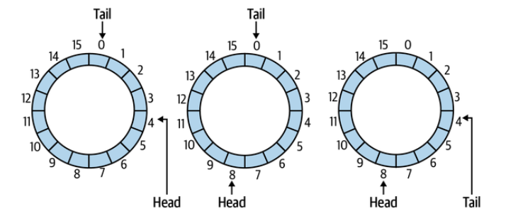
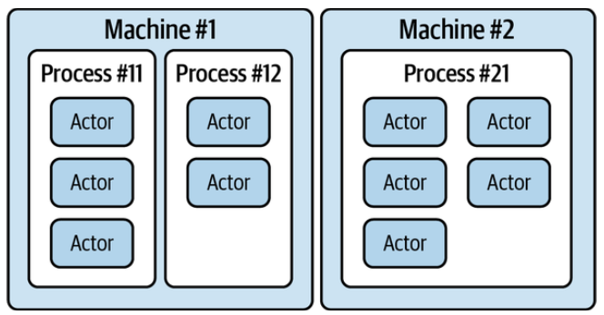

# Multithreaded Patterns

1. [Thread Pool](#Pool)
2. [Dispatch Strategies](#Dispatch)
3. [Mutex: A Basic Lock](#Mutex)
4. [Streaming Data with Ring Buffers](#Streaming)
5. [Actor Model](#Actor)

# <a id="Pool"></a> Thread Pool

Essentially, a thread pool is a collection of homogeneous worker threads that are each capable of carrying out CPU-intensive tasks that the application may depend on.

### Pool Size

The number of CPU cores available to the machine should be a determining factor for the number of threads—aka workers—an application should use.

Here is the idiomatic approach for getting the number of threads available to the currently running JavaScript application, depending on whether the code runs inside a browser or inside a Node.js process:

```js
// browser
cores = navigator.hardwareConcurrency;
// Node.js
cores = require("os").cpus().length;
```

Each time a CPU core switches focus between programs—or threads of a program—a small context shift overhead comes into play. Because of this, having too many threads compared to the number of CPU cores can cause a loss of performance.

# <a id="Dispatch"></a> Dispatch Strategies

- Round robin
  Each task is given to the next worker in the pool, wrapping around to the beginning once the end has been hit. So, with a pool size of three, the first task goes to Worker 1, then Worker 2, then Worker 3, then back to Worker 1, and so on. The benefit of this is that each thread gets the exact same number of tasks to perform, but the drawback is that if the complexities of each task is a multiple of the number of threads (like each 6th task takes a long time to perform), then there will be an unfair distribution of work. The HAProxy reverse proxy refers to this as roundrobin.

- Random
  Each task is assigned to a random worker in the pool. Although this is the simplest to build, being entirely stateless, it can also mean that some of the workers are sometimes given too much work to perform, and others will sometimes be given too little work to perform. The HAProxy reverse proxy refers to this as random.

- Least busy
  A count of the number of tasks being performed by each worker is maintained, and when a new task comes along it is given to the least busy worker. This can even be extrapolated so that each worker only has a single task to perform at a time. When two workers have a tie for the least amount of work, then one can be chosen randomly. This is perhaps the most robust approach, especially if each task consumes the same amount of CPU, but it does require the most effort to implement. If some tasks use fewer resources, such as if a task calls setTimeout(), then it can lead to skew in worker workloads. HAProxy refers to this as leastconn.

Example Implementation

[Thread Pool](../Examples/ThreadPool/README.md)

# <a id="Mutex"></a> Mutex: A Basic Lock

A mutually exclusive lock, or mutex, is a mechanism for controlling access to some shared data. It ensures that only one task may use that resource at any given time. Here, a task can mean any sort of concurrent task, but most often the concept is used when working with multiple threads, to avoid race conditions.

[thread-product-mutex](../Examples/Mutex/thread-product-mutex.js)

# <a id="Streaming"></a> Streaming Data with Ring Buffers

Streaming data also occurs in user applications and can be used as a way to transfer larger amounts of data between computation units, like processes or threads. Even without separate computation units, you may want or need to hold data in some kind of buffer before processing it. This is where ring buffers, also known as circular buffers, come in handy.

- A ring buffer is an implementation of a first-in-first-out (FIFO) queue, implemented using a pair of indices into an array of data in memory.

To implement a ring buffer, we’ll need the two indices, head and tail. The head index refers to the next position to add data into the queue, and the tail index refers to the next position to read data out of the queue from. When data is written to or read from the queue, we increase the head or tail index, respectively, by the amount of data written or read, modulo the size of the buffer.


[ringBuffer](../Examples/ringBuffer/ring-buffer.js)

# <a id="Actor"></a> Actor Model

With this model an actor is a primitive container that allows for executing code. An actor is capable of running logic, creating more actors, sending messages to other actors, and receiving messages.

The actor model is designed to allow computations to run in a highly parallelized manner without necessarily having to worry about where the code is running or even the protocol used to implement the communication. Really, it should be transparent to program code whether one actor communicates with another actor locally or remotely.



Actors are able to process each message, or task, that they receive one at a time. When these messages are first received, they sit in a message queue, sometimes referred to as a mailbox. Having a queue is convenient because if two messages were received at once then they both shouldn’t be processed at the same time. Without a queue, one actor might need to check if another actor is ready before sending a message, which would be a very tedious process.

- There’s no shared memory involved

- In many ways, an actor is like a function in a functional language, accepting inputs and avoiding access to global state.

- While a single actor is only able to process a single task at a time, different actors are free to run code in parallel.

- One draw of the actor model is that actors don’t need to be limited to a single machine.

[Actors](../Examples/Actors/README.md)
